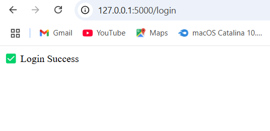
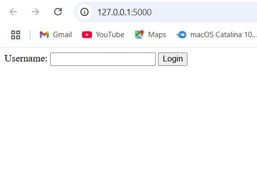
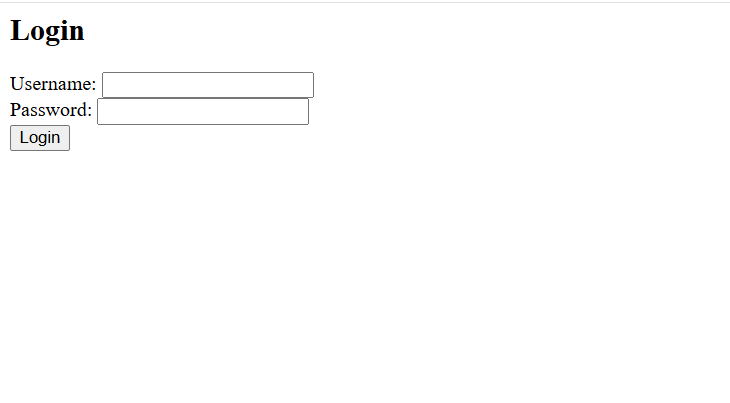

# 🔐 SQL Injection Demo App

A simple Flask + SQLite web app intentionally designed to be **vulnerable to SQL Injection attacks**. Created for learning and demonstrating how SQL injection works and how to prevent it using secure coding practices.

> ⚠️ This project is for educational purposes only. Do not use it in production.

---

## 🚀 Features

- Insecure login form (vulnerable to SQL Injection)
- Basic HTML interface
- SQLite backend
- Fix examples using parameterized queries

---

## 🛠 Tech Stack

- Python 3
- Flask (Web Framework)
- SQLite3 (Database)
- HTML (for frontend)

---

## 📦 Installation

```bash
git clone https://github.com/rakeshchinna1724/sql-injection-demo.git
cd sql-injection-demo
pip install -r requirements.txt
python init_db.py       # Setup the database
python app.py           # Start the Flask server
Visit: http://127.0.0.1:5000

🧪 SQL Injection Example
Try logging in with:

vbnet
Copy
Edit
Username: ' OR '1'='1
Password: anything


📚 Learning Resources
OWASP: SQL Injection

Python Flask Tutorial

SQL Injection Basics – GeeksforGeeks


## 📷 Screenshots

### 💻 Login Page


### 🧪 Injection Bypass


### 🔐 Fixed Version
